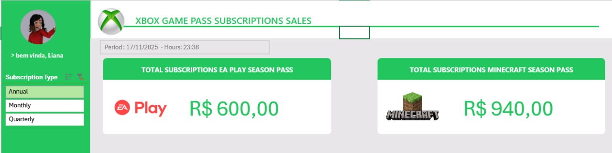
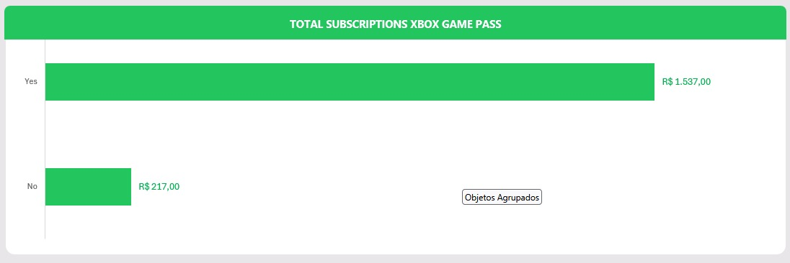

# Desafio dashboard de vendas Xbox com Excel

## Objetivo 

Este dashboard tem como intuito por em prática o conteúdo das aulas de Excel, foi utilizado o dataset ficticio de assinaturas do Xbox, ele possui  14 colunas e 296 linhas.

### Descrição das colunas

- Subscriber ID -> Identificador do assinante
- Name -> Nome do assinante
- Plan -> Tipo de plano: Core,Standard,Ultimate
- Auto Renewal -> Indica se a assinatura é renovada automaticamente
- Subscription Price -> Valor da assinatura principal
- Subscription Type -> Frequência da assinatura:Monthly,Quarterly,Annual
- EA Play Season Pass -> Indica se o EA Play foi contratado
- EA Play Season Pass Price -> Valor pago pelo EA Play
- Minecraft Season Pass -> Indica se o Minecraft foi contratado
- Minecraft Season Price ->Valor pago pelo Minecraft
- Coupon Value -> Valor total pago após descontos
  

### Descrição do dashboard

Nesse dashboard no lado esquerdo mostra o filtro do periodo de assinatura onde vc seleciona e ele mostra as alterações no gráfico de barras e nos BigNumbers, esses BigNumbers mostra o total de assinaturas do EA Play e o total de assinaturas do Minecraft, o gráfico de barras indica o total de vendas de plano de assinatura.

